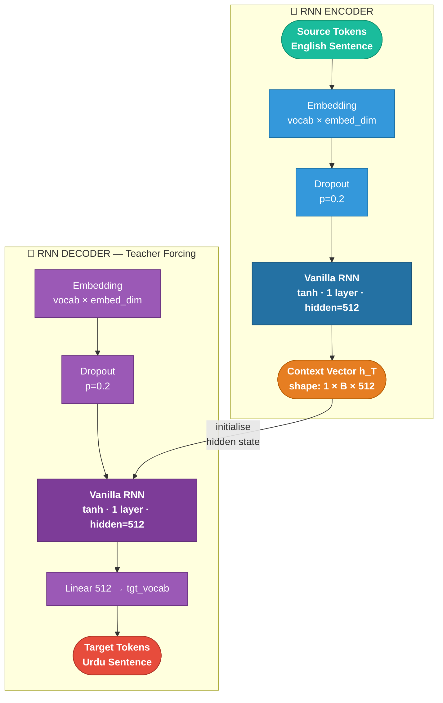

# 🌐 English → Urdu Neural Machine Translation

<p align="center">
  
  
  
  
  
</p>

<p align="center">
  A complete from-scratch implementation of an <strong>English → Urdu Neural Machine Translation (NMT)</strong> system<br>
  using a <strong>Vanilla RNN Encoder–Decoder</strong> in PyTorch — no LSTMs, GRUs, or Attention.
</p>

---

## 📋 Table of Contents

- [Overview](#-overview)
- [Project Structure](#-project-structure)
- [Model Architecture](#-model-architecture)
- [Setup & Execution](#-setup--execution)
- [Section 1 — Environment Setup](#1️⃣-section-1--environment-setup)
- [Section 2 — Data Loading & Exploration](#2️⃣-section-2--data-loading--exploration)
- [Section 3 — Data Preprocessing](#3️⃣-section-3--data-preprocessing)
- [Section 4 — Train / Val / Test Split](#4️⃣-section-4--train--val--test-split)
- [Section 5 — Tokenisation & Vocabulary](#5️⃣-section-5--tokenisation--vocabulary)
- [Section 6 — Batching & Padding](#6️⃣-section-6--batching--padding)
- [Section 7 — Model Summary](#7️⃣-section-7--model-summary)
- [Section 8 — Training Dynamics](#8️⃣-section-8--training-dynamics)
- [Section 9 — Hyperparameter Grid Search](#9️⃣-section-9--hyperparameter-grid-search)
- [Section 10 — Inference & BLEU Evaluation](#-section-10--inference--bleu-evaluation)
- [Section 11 — Error Analysis & Discussion](#️-section-11--error-analysis--discussion)
- [Final Experiment Summary](#-final-experiment-summary)
- [Generated Artifacts](#-generated-artifacts)

---

## 🧭 Overview

This project implements the **entire NMT pipeline from scratch**, adhering strictly to the constraint of plain `torch.nn.RNN` only — no gating, no attention. The goal is to empirically quantify the architectural limitations of vanilla RNNs on a morphologically rich, verb-final (SOV) target language.

**At a glance:**

| Metric | Value |
|---|---|
| Dataset (after cleaning) | **8,542** pairs |
| English vocab | **3,821** tokens |
| Urdu vocab | **4,094** tokens |
| Total parameters | **4,914,942** (19.66 MB) |
| Best validation PPL | **41.34** @ epoch 10 |
| Greedy BLEU-1 / BLEU-4 | **21.03** / **0.90** |
| Beam-4 BLEU-1 / BLEU-4 | **12.47** / **0.96** |
| Dominant error | Complete Hallucination — **65.7%** |

---

## 🏗️ Project Structure

```text
ENG-URDU-NMT-RNN/
├── data/
│   └── english_to_urdu_dataset.xlsx       # Raw parallel corpus (9,103 pairs)
├── notebooks/
│   ├── dataset_statistics.ipynb           # EDA, OOD & statistical analysis
│   └── english_to_urdu_nmt.ipynb          # Full NMT pipeline (Sections 1–11)
├── outputs/
│   ├── checkpoints/
│   │   └── best_model.pt                  # Best checkpoint (epoch 10)
│   ├── plots/                             # 11 evaluation figures (PNG)
│   └── results/                           # CSV reports + pickled vocabularies
├── src/
│   └── english_to_urdu_nmt.py             # Standalone Python script
├── LNCS_Report/                           # Springer LNCS LaTeX report
├── images/
│   ├── 06a_rnn_encoder_decoder.png        # Architecture diagram
│   └── 06b_context_vector.svg             # Context vector SVG
├── architecture.mmd                       # Mermaid diagram source
├── requirements.txt
└── README.md
```

---

## 🧠 Model Architecture

### Architecture Diagram

<p align="center">
  
</p>

<p align="center"><em>Vanilla RNN Encoder–Decoder. The encoder compresses the full English sentence into a single context vector <code>h_T</code>, which initialises the decoder to generate Urdu tokens one-by-one.</em></p>

### Mermaid Diagram



### How It Works

| Step | Component | Detail |
|---|---|---|
| 1 | **Encoder Embedding** | Maps each English token → 256-dim dense vector |
| 2 | **Encoder RNN** | `h_t = tanh(W_ih·x_t + W_hh·h_{t-1} + b)` — updates hidden state token-by-token |
| 3 | **Context Vector** | Final hidden state `h_T` (512-dim) — the *only* information passed to decoder |
| 4 | **Decoder Embedding** | Maps previous Urdu token → 256-dim vector |
| 5 | **Decoder RNN** | Conditioned on `h_T`, generates next hidden state |
| 6 | **Output Projection** | Linear 512 → 4094 + softmax → next Urdu token |

### Parameter Breakdown

| Component | Parameters | Size (MB) |
|---|---|---|
| Encoder Embedding (3821 × 256) | 977,664 | 3.91 |
| Encoder RNN (1 layer) | 920,064 | 3.68 |
| Decoder Embedding (4094 × 256) | 1,048,064 | 4.19 |
| Decoder RNN (1 layer) | 920,064 | 3.68 |
| Output Projection (512 → 4094) | **2,096,382** | **8.39** |
| **Total** | **4,914,942** | **19.66** |

> Output projection dominates at **42.7%** of all parameters — a direct consequence of the large Urdu vocabulary.

---

## 🚀 Setup & Execution

```bash
# 1. Clone
git clone https://github.com/code-with-idrees/Machine_Translation_RNN.git
cd Machine_Translation_RNN

# 2. Virtual environment
python -m venv .venv
source .venv/bin/activate          # Linux/macOS
# .venv\Scripts\activate           # Windows

# 3. Install dependencies
pip install -r requirements.txt

# 4. Place dataset
#    Put english_to_urdu_dataset.xlsx inside data/

# 5a. Run EDA notebook
jupyter notebook notebooks/dataset_statistics.ipynb

# 5b. Run full NMT pipeline
jupyter notebook notebooks/english_to_urdu_nmt.ipynb

# 5c. Or run as a script
python src/english_to_urdu_nmt.py
```

> Tested on **NVIDIA Tesla T4 (15.64 GB VRAM)** and **RTX 4060 Laptop (8 GB)**. The pipeline auto-detects GPU and falls back to CPU.

---

## 1️⃣ Section 1 — Environment Setup

All random seeds locked (`SEED = 42`) across PyTorch, NumPy, and Python for full deterministic reproducibility.

```
  Python     : 3.12.12          PyTorch    : 2.10.0+cu128
  NumPy      : 2.0.2            Pandas     : 2.2.2
  Device     : cuda             GPU        : Tesla T4
  VRAM (GB)  : 15.64            CUDA       : 12.8
  ✅  Environment ready.
```

---

## 2️⃣ Section 2 — Data Loading & Exploration

```
  Shape   : (9103, 2)   |   Columns : ['eng', 'urdu']
  Pairs   : 9,103       |   Memory  : 3.76 MB

  Missing values  →  eng: 0,  urdu: 1
  Full duplicate rows : 9  (0.10%)
```

**Raw corpus statistics:**

| Metric | English | Urdu |
|---|---|---|
| Total tokens | 187,636 | 210,640 |
| Unique tokens | 7,156 | 8,111 |
| Type–token ratio | 0.0381 | 0.0385 |
| Mean length (tokens) | 20.61 | 23.14 |
| Std dev | 9.70 | 10.63 |
| Median length | 20 | 23 |
| Max length | 68 | 84 |
| Mean length ratio (Urdu/Eng) | **1.161 ± 0.268** | |

**Top-15 English tokens:** `the (11180)` · `and (10750)` · `of (6167)` · `that (3820)` · `to (3581)` · `he (3108)` · `in (2990)` · `him (2484)` · `unto (2447)` · `for (2321)` · `is (2261)` · `i (2185)` · `not (2101)` · `a (2062)` · `they (1969)`

**Top-15 Urdu tokens:** `۔ (9633)` · `اور (8698)` · `کے (6324)` · `سے (6022)` · `میں (5853)` · `اس (5691)` · `کی (4224)` · `ہے (4214)` · `نے (3946)` · `کو (3702)` · `کہ (3562)` · `وہ (2790)` · `تو (2320)` · `کا (2234)` · `جو (2153)`

---

### 📊 Plot 01 — Corpus Exploration

<p align="center">
  
</p>

> **What this shows:** English and Urdu sentence-length histograms; Urdu/English length-ratio distribution; scatter of Eng vs Urdu lengths coloured by ratio; length box-plots; top-20 English token frequency bar chart (log scale).

---

## 3️⃣ Section 3 — Data Preprocessing

Two dedicated cleaning pipelines are applied before any filtering.

**English pipeline:**
Lowercasing → URL/email stripping → Unicode NFKC normalisation → repeated-punctuation collapsing → whitespace normalisation.

**Urdu pipeline:**
Urdu punctuation mapping (`۔→.` · `،→,` · `؟→?`) → zero-width character removal → bracketed annotation stripping → Urdu-script ratio check.

**Sequential quality filters:**

| Filter | Rows Removed | Reason |
|---|---|---|
| Null removal | −19 | Empty after cleaning |
| Exact deduplication | −9 | Full duplicate rows |
| Urdu script ratio < 40% | −1 | Non-Urdu content |
| Length cap at 97th pct (≤40 / ≤44 tokens) | −361 | GPU-memory outliers |
| Length-ratio filter [0.67 – 2.20] | −171 | Extreme length asymmetry |
| **Final corpus** | **8,542 pairs** | **93.8% retained** |

```
  97th pct English length : 40 tokens
  97th pct Urdu length    : 44 tokens
  Ratio bounds            : [0.67 , 2.20]
  💾  Saved: outputs/results/cleaned_dataset.csv
```

**5 cleaned samples:**
```
ENG : they say unto him why did moses then command to give a writing of divorcement
URDU: انہوں نے اس سے کہا پھر موسی نے کیوں حکم دیا ہے کہ طلاقنامہ دے کر چھوڑ دی جائے

ENG : tom can fix the heater.
URDU: ٹام ہیٹر ٹھیک کر سکتا ہے.

ENG : my mother has made me what i am today.
URDU: میں آج جو کچھ ہوں, اپنی ماں کی وجہ سے ہوں.
```

---

### 📊 Plot 02 — Preprocessing Analysis

<p align="center">
  
</p>

> **What this shows:** English/Urdu length distributions before and after filtering; Urdu script-ratio histogram with the 40% threshold line; cleaned length-ratio histogram; Eng vs Urdu length scatter coloured by script ratio; dataset-size funnel tracking rows removed at each filter stage.

---

## 4️⃣ Section 4 — Train / Val / Test Split

Stratified split on 5 quantile bins of source-sentence length. Fixed `random_state = 42`. Zero overlap verified programmatically after splitting.

| Split | Pairs | % | Eng μ ± σ | Urdu μ ± σ |
|---|---|---|---|---|
| **Train** | 6,823 | 79.9% | 19.9 ± 8.6 | 22.5 ± 9.3 |
| **Validation** | 864 | 10.1% | 19.7 ± 8.7 | 22.4 ± 9.5 |
| **Test** | 855 | 10.0% | 19.7 ± 8.6 | 22.4 ± 9.2 |

```
  Overlap Train ∩ Val  : 0  ✅
  Overlap Train ∩ Test : 0  ✅
  Overlap Val  ∩ Test  : 0  ✅
  ✅  Zero data leakage confirmed across all three splits.
```

---

### 📊 Plot 03 — Dataset Split

<p align="center">
  
</p>

> **What this shows:** Proportions pie chart; English token-length density per split; Urdu token-length density per split. All three distributions are near-identical, confirming successful stratification.

---

## 5️⃣ Section 5 — Tokenisation & Vocabulary

Word-level tokenisation (whitespace split after normalisation). Vocabularies built from **training set only** (`min_freq = 2`) to prevent leakage.

**Special tokens:**

| Token | Index | Role |
|---|---|---|
| `<pad>` | 0 | Sequence padding |
| `<bos>` | 1 | Begin-of-sentence (decoder input start) |
| `<eos>` | 2 | End-of-sentence (generation stop) |
| `<unk>` | 3 | Out-of-vocabulary token |

```
  English (source) vocab size       : 3,821   (singletons excluded: 2,372)
  Urdu    (target) vocab size       : 4,094   (singletons excluded: 2,869)
  Min frequency threshold           : 2
```

**OOV analysis:**

| Split | ENG OOV tokens | ENG OOV rate | URDU OOV tokens | URDU OOV rate |
|---|---|---|---|---|
| Validation | 582 / 16,993 | **3.42%** | 666 / 19,334 | **3.44%** |
| Test | 564 / 16,846 | **3.35%** | 613 / 19,112 | **3.21%** |

Top OOV (val ENG): `college (5)` · `train (4)` · `wherever (4)` · `want. (4)` · `diseases (3)`

---

### 📊 Plot 04 — Vocabulary Analysis

<p align="center">
  
</p>

> **What this shows:** Zipf distributions (log–log scale) for both vocabularies; top-30 token bar charts (English & Urdu); cumulative coverage curves with 80 / 90 / 95% markers; English token frequency-bin histogram showing the long tail of singletons.

---

## 6️⃣ Section 6 — Batching & Padding

- **Source:** Each English sentence encoded with terminal `<eos>`.
- **Target:** Urdu sentences bookended with `<bos>` and `<eos>`. Decoder input (`tgt_in`) is right-shifted; labels (`tgt_out`) are left-shifted.
- **Padding:** Dynamic — sequences padded to the **batch maximum** length, not a global maximum. This significantly reduces wasted computation.

```
  Train batches : 107   |   Val batches : 14   |   Test batches : 14
  Batch size    : 64

  src     shape : torch.Size([64, 39])    →  src    padding ratio : 48.9%
  tgt_in  shape : torch.Size([64, 45])    →  tgt_in padding ratio : 49.1%
  tgt_out shape : torch.Size([64, 45])

  Teacher-forcing check:
    tgt_in  first token = BOS (1)  ✅
    tgt_out last  token = EOS (2) or <pad>  ✅
```

---

### 📊 Plot 05 — Batch Structure

<p align="center">
  
</p>

> **What this shows:** Source token-ID heatmap (first 16 samples in a batch); padding mask visualisation (red cells = `<pad>` positions); source sequence length histogram within the batch.

---

## 7️⃣ Section 7 — Model Summary

```
Seq2Seq(
  (encoder): RNNEncoder(
    (embedding): Embedding(3821, 256, padding_idx=0)
    (dropout):   Dropout(p=0.2, inplace=False)
    (rnn):       RNN(256, 512, num_layers=1, batch_first=True)
  )
  (decoder): RNNDecoder(
    (embedding): Embedding(4094, 256, padding_idx=0)
    (dropout):   Dropout(p=0.2, inplace=False)
    (rnn):       RNN(256, 512, num_layers=1, batch_first=True)
    (fc_out):    Linear(in_features=512, out_features=4094, bias=True)
  )
)

  Encoder parameters  : 1,897,728
  Decoder parameters  : 3,017,214
  Total parameters    : 4,914,942   (19.66 MB · float32)
  Device              : cuda:0

  Forward pass sanity check:
    Input  src    : (4, 12)
    Input  tgt_in : (4, 10)
    Output logits : (4, 10, 4094)  ✅
```

---

### 📊 Plot 06 — Model Architecture

<p align="center">
  
</p>

> **What this shows:** Pie chart of parameter share per component; horizontal bar chart with absolute parameter counts per layer. The output projection dominates at 42.7% owing to the large Urdu vocabulary.

---

## 8️⃣ Section 8 — Training Dynamics

**Configuration:**

| Setting | Value |
|---|---|
| Loss function | Label-smoothed cross-entropy (ε = 0.1) |
| Optimizer | Adam (β₁=0.9, β₂=0.98, ε=1e-8) |
| Gradient clipping | L2 norm ≤ 1.0 |
| LR scheduler | ReduceLROnPlateau (factor=0.5, patience=3) |
| Early stopping | patience = 7 epochs |
| Max epochs | 30 |

**Full 17-epoch training log (best config, retrained):**

```
  Epoch │ Train Loss │  Val Loss │  Val PPL │       LR │  Time
  ─────────────────────────────────────────────────────────────────
      1 │     5.1460 │    4.7228 │   112.48 │ 1.00e-03 │  2.8s  ← BEST ✓
      2 │     4.4642 │    4.2117 │    67.47 │ 1.00e-03 │  2.6s  ← BEST ✓
      3 │     4.1100 │    4.0237 │    55.90 │ 1.00e-03 │  2.6s  ← BEST ✓
      4 │     3.8972 │    3.9067 │    49.73 │ 1.00e-03 │  2.6s  ← BEST ✓
      5 │     3.7202 │    3.8362 │    46.35 │ 1.00e-03 │  2.6s  ← BEST ✓
      6 │     3.5698 │    3.7910 │    44.30 │ 1.00e-03 │  2.7s  ← BEST ✓
      7 │     3.4349 │    3.7641 │    43.12 │ 1.00e-03 │  2.6s  ← BEST ✓
      8 │     3.3140 │    3.7371 │    41.98 │ 1.00e-03 │  2.6s  ← BEST ✓
      9 │     3.1974 │    3.7295 │    41.66 │ 1.00e-03 │  2.6s  ← BEST ✓
  ★  10 │     3.0917 │    3.7217 │    41.34 │ 1.00e-03 │  2.7s  ← BEST ✓  ← SAVED
     11 │     2.9902 │    3.7284 │    41.61 │ 1.00e-03 │  2.6s
     12 │     2.8940 │    3.7319 │    41.76 │ 1.00e-03 │  2.6s
     13 │     2.8034 │    3.7417 │    42.17 │ 1.00e-03 │  2.6s
     14 │     2.7160 │    3.7436 │    42.25 │ 1.00e-03 │  2.6s
     15 │     2.5652 │    3.7408 │    42.13 │ 5.00e-04 │  2.8s  ← LR halved
     16 │     2.5134 │    3.7495 │    42.50 │ 5.00e-04 │  2.6s
     17 │     2.4694 │    3.7549 │    42.73 │ 5.00e-04 │  2.6s
  ⏹  Early stopping triggered at epoch 17.

  ✅  Best epoch : 10  |  Best val loss : 3.7217  |  Best val PPL : 41.34
  ⚠️  Generalisation gap at best epoch : 0.63  (moderate overfitting)
```

**Key observations:**
- Training loss drops monotonically from 5.15 → 2.47 over 17 epochs.
- Validation loss reaches minimum **3.7217** at epoch 10, then plateaus — classic bottleneck saturation.
- LR halved once at epoch 15 via ReduceLROnPlateau but yields no further improvement.
- Gradient norms remain below the 1.0 clip threshold throughout — stable training.

---

### 📊 Plot 07 — Training Dynamics

<p align="center">
  
</p>

> **What this shows:** Train vs validation loss curves with generalisation-gap shading and best-epoch marker; perplexity curves; LR schedule; gradient L2 norm per epoch.

---

## 9️⃣ Section 9 — Hyperparameter Grid Search

**8 configurations × 8 epochs each.** Search space: embedding dim · hidden dim · RNN layers · learning rate · dropout · batch size.

**Full grid search leaderboard:**

| Rank | Emb | Hid | L | LR | Drop | BS | Val Loss | Val PPL | Params |
|---|---|---|---|---|---|---|---|---|---|
| 🥇 **1** | 256 | 512 | **1** | 1e-3 | 0.2 | 64 | **3.735** | **41.89** | 4,914,942 |
| 2 | 256 | 256 | 1 | 1e-3 | 0.2 | 64 | 3.741 | 42.13 | 3,341,566 |
| 3 | 256 | 512 | 2 | 1e-3 | 0.2 | 64 | 3.809 | 45.09 | 5,965,566 |
| 4 | 128 | 256 | 1 | 1e-3 | 0.2 | 64 | 3.829 | 46.00 | 2,262,910 |
| 5 | 128 | 512 | 1 | 1e-3 | 0.2 | 64 | 3.834 | 46.23 | 3,770,750 |
| 6 | 256 | 512 | 2 | 1e-3 | 0.3 | 32 | 3.836 | 46.35 | 5,965,566 |
| 7 | 256 | 512 | 2 | 1e-3 | 0.3 | 64 | 3.894 | 49.10 | 5,965,566 |
| 8 | 256 | 512 | 2 | 5e-4 | 0.2 | 64 | 3.913 | 50.06 | 5,965,566 |

**Optimal hyperparameter configuration:**

| Hyperparameter | Search Range | ✅ Optimal |
|---|---|---|
| Embedding Dimension | {128, 256} | **256** |
| Hidden Dimension | {256, 512} | **512** |
| RNN Layers | {1, 2} | **1** |
| Learning Rate | {5e-4, 1e-3} | **1e-3** |
| Dropout | {0.2, 0.3} | **0.2** |
| Batch Size | {32, 64} | **64** |

> **Key insight:** 1-layer RNN (rank 1) beats 2-layer (rank 3) — added depth creates more vanishing-gradient pathways without providing the gating benefit of LSTM/GRU.

---

### 📊 Plot 08 — Hyperparameter Search

<p align="center">
  
</p>

> **What this shows:** Ranked validation loss bar chart; parameter count vs validation loss scatter; validation loss curves for all 8 configs across 8 epochs; per-hyperparameter effect bar charts (embedding dim, RNN layers); time–performance trade-off coloured by parameter count.

---

## 🔟 Section 10 — Inference & BLEU Evaluation

Best checkpoint (epoch 10, val loss = 3.7217) evaluated on all **855 test sentences**.

**Decoding methods:**

| Method | Strategy | Avg Speed |
|---|---|---|
| **Greedy** | `argmax` at every step | **19.7 ms / sent** |
| **Beam (k=4)** | Length-normalised log-prob, α = 0.7 | 136.5 ms / sent *(6.9× slower)* |

**BLEU scores on test set (855 sentences, Chen–Cherry smoothing):**

| Decoding Method | BLEU-1 | BLEU-2 | BLEU-3 | BLEU-4 |
|---|---|---|---|---|
| **Greedy** | **21.026** | **7.420** | **2.573** | 0.903 |
| **Beam (k=4)** | 12.470 | 4.232 | 1.830 | **0.957** |

Sentence-level: Greedy `2.31 ± 1.39` &nbsp;·&nbsp; Beam-4 `1.79 ± 2.04`

> Greedy achieves higher BLEU-1/2; beam-4 marginally improves BLEU-4 at 6.9× latency cost.

**OOD robustness** (> 31 tokens or ≥ 2 OOV tokens):

| Condition | n | BLEU-1 | BLEU-2 | BLEU-3 | BLEU-4 |
|---|---|---|---|---|---|
| In-Distribution | 655 | 13.373 | 4.678 | 2.018 | 1.015 |
| OOD | 200 | 9.732 | 3.210 | 1.411 | 0.739 |
| **Drop** | | −3.641 | −1.468 | −0.607 | −0.276 |
| **Relative drop** | | **−27.2%** | **−31.4%** | **−30.1%** | **−27.2%** |

**Decoding demo (5 samples):**

```
[1] SRC : and solomon begat roboam and roboam begat abia and abia begat asa
     REF : اور سلیمان سے رحبعام پیدا ہوا اور رحبعام سے ابیاہ پیدا ہوا اور ابیاہ سے آسا پیدا ہوا
     BM4 : اس نے ان سے کہا اے خداوند میں تجھ سے کہتا ہوں .

[2] SRC : blessed are the poor in spirit for theirs is the kingdom of heaven
     REF : مبارک ہیں وہ جو دل کے غریب ہیں کیونکہ آسمان کی بادشاہی ان ہی کی ہے .
     BM4 : اس نے ان سے کہا اے خداوند میں تجھ سے کہتا ہوں .

[3] SRC : he saith unto them but whom say ye that i am
     REF : اس نے ان سے کہا مگر تم مجھے کیا کہتے ہو
     BM4 : اس نے ان سے کہا اے خداوند میں تجھ سے کہتا ہوں .   ← BLEU 28.92 (best)
```

---

### 📊 Plot 09 — BLEU Evaluation

<p align="center">
  
</p>

> **What this shows:** Corpus BLEU-1 to BLEU-4 grouped bar (greedy vs beam-4); sentence BLEU density distribution; source length vs sentence BLEU scatter with trend line; reference vs hypothesis length; decoding latency box-plots; sentence BLEU CDF for both methods.

---

## 1️⃣1️⃣ Section 11 — Error Analysis & Discussion

All 855 beam-4 outputs classified into 8 error categories using automated heuristics validated by manual inspection of 50 samples.

**Error type distribution:**

| Error Type | Count | % | Definition |
|---|---|---|---|
| 🔴 **Complete Hallucination** | **562** | **65.7%** | Zero lexical overlap with reference |
| 🟠 Partial Match | 251 | 29.4% | Some content correct but incomplete |
| 🟡 Severe Over-generation | 23 | 2.7% | Hypothesis > 200% reference length |
| 🟢 Near Miss | 7 | 0.8% | High overlap, minor lexical errors |
| 🔵 Poor Reordering | 7 | 0.8% | Correct vocab, wrong word order |
| ✅ Acceptable (BLEU ≥ 20) | 2 | 0.2% | Reasonably correct |
| 🔁 Repetition Loop | 2 | 0.2% | Decoder stuck in same-token loop |
| ⬇️ Severe Under-generation | 1 | 0.1% | Hypothesis < 30% reference length |

**🚨 Dominant failure — Fixed-Phrase Mode Collapse (65.7%)**

Nearly two-thirds of all outputs collapse to a single fixed phrase:

> **اس نے ان سے کہا اے خداوند میں تجھ سے کہتا ہوں .**
> *(He said to them, O Lord, I say to thee.)*

This is the maximum-likelihood degenerate solution when the context vector `h_T` carries insufficient discriminative signal for the decoder to distinguish between inputs. It is a canonical symptom of the fixed-size bottleneck in non-attentive models.

**Top-5 best translations (Beam-4):**

| # | English Source | BLEU | Label |
|---|---|---|---|
| 1 | he saith unto them but whom say ye that i am | **28.92** | Acceptable |
| 2 | and after that they durst not ask him any question at all | 24.79 | Acceptable |
| 3 | but i have prayed for thee that thy faith fail not | 16.96 | Near Miss |
| 4 | philip saith unto him lord shew us the father | 16.35 | Near Miss |
| 5 | and they brought it and he saith unto them | 13.50 | Near Miss |

**Limitations of vanilla RNNs — quantified:**

| Limitation | Root Cause | Empirical Evidence |
|---|---|---|
| **Vanishing gradients** | `tanh` shrinks ∂h/∂h exponentially with sequence depth | Val loss plateaus hard at epoch 10 |
| **Information bottleneck** | Entire sentence → single 512-D vector `h_T` | 65.7% mode-collapse; −27.2% OOD BLEU-4 |
| **Poor word-order reordering** | No attention to re-access source positions | "Poor Reordering" error class |
| **Repetition / degeneration** | No coverage mechanism | Repetition Loop errors |
| **OOV sensitivity** | Word-level vocab; rare tokens → `<unk>` | −31.4% OOD BLEU-2 drop |

**Future improvement roadmap:**

| Priority | Improvement | Expected Gain |
|---|---|---|
| 🔴 Immediate | LSTM / GRU cells | Address vanishing gradients |
| 🔴 Immediate | Bidirectional encoder | Richer context representations |
| 🔴 Immediate | Bahdanau attention | Eliminate bottleneck entirely |
| 🔴 Immediate | BPE / SentencePiece | Cut OOV rate to < 1% |
| 🟡 Medium | Full Transformer | State-of-the-art architecture |
| 🟡 Medium | Fine-tune mBART-50 | Cross-lingual transfer learning |
| 🟢 Long-term | Back-translation | More diverse training data |
| 🟢 Long-term | Broader Urdu corpus | Beyond biblical domain bias |

---

### 📊 Plot 10 — Error Analysis

<p align="center">
  
</p>

> **What this shows:** Error type distribution bar chart; sentence BLEU box-plots per error category; OOV count vs sentence BLEU scatter; ID vs OOD BLEU-4 comparison bars; source-length violin plots by error type; hypothesis-length distributions for top-4 error categories.

---

## 📊 Final Experiment Summary

```
╔══════════════════════════════ FINAL EXPERIMENT SUMMARY ═══════════════════════╗

  ── DATASET ───────────────────────────────────────────────────────────────────
  Raw sentence pairs                    : 9,103
  After all cleaning & filtering        : 8,542  (93.8% retention)
  Train / Val / Test                    : 6,823 / 864 / 855

  ── VOCABULARY ────────────────────────────────────────────────────────────────
  English vocab size                    : 3,821
  Urdu vocab size                       : 4,094
  Min token frequency                   : 2
  Val OOV rate (ENG / URDU)             : 3.42% / 3.44%

  ── MODEL ─────────────────────────────────────────────────────────────────────
  Architecture                          : Vanilla RNN Encoder-Decoder (tanh)
  Embedding dim / Hidden dim / Layers   : 256 / 512 / 1
  Dropout / Label smoothing             : 0.2 / 0.1
  Total parameters                      : 4,914,942
  Model size (MB)                       : 19.66

  ── TRAINING ──────────────────────────────────────────────────────────────────
  Epochs trained / Best epoch           : 17 / 10
  Best val loss / PPL                   : 3.7217 / 41.34
  Final train loss                      : 2.4694
  Generalization gap                    : 0.6300

  ── TEST SET EVALUATION ───────────────────────────────────────────────────────
  Greedy  BLEU-1 / BLEU-4               : 21.026 / 0.903
  Beam-4  BLEU-1 / BLEU-4               : 12.470 / 0.957
  Beam-4 avg decode time (ms/sent)      : 136.5

  ── OOD EVALUATION ────────────────────────────────────────────────────────────
  ID  BLEU-4 (beam-4)                   : 1.015
  OOD BLEU-4 (beam-4)                   : 0.739
  Relative degradation                  : −27.2%

  ── ERROR ANALYSIS ────────────────────────────────────────────────────────────
  Most common error                     : Complete Hallucination (65.7%)
  Acceptable translations               : 0.2%  (2 / 855)

╚══════════════════════════════════════════════════════════════════════════════╝
```

### 📊 Plot 11 — Final Dashboard

<p align="center">
  
</p>

> **What this shows:** 4-panel consolidated dashboard — train/val loss curves with best-epoch marker; corpus BLEU-1 to BLEU-4 for greedy and beam-4; sentence BLEU density distribution; error-type pie chart.

---

## 📁 Generated Artifacts

**`outputs/plots/`** — 11 PNG figures auto-generated by the notebook

| File | Description |
|---|---|
| `01_corpus_exploration.png` | Length histograms, top-token frequencies |
| `02_preprocessing_analysis.png` | Filter funnel, script-ratio analysis |
| `03_dataset_split.png` | Split proportions, length densities |
| `04_vocabulary_analysis.png` | Zipf curves, top-30 tokens |
| `05_batch_structure.png` | Token-ID heatmap, padding mask |
| `06_model_architecture.png` | Parameter breakdown |
| `07_training_dynamics.png` | Loss/PPL/LR/grad-norm curves |
| `08_hyperparameter_search.png` | Grid search leaderboard & curves |
| `09_bleu_evaluation.png` | BLEU bars, scatter, CDF, latency |
| `10_error_analysis.png` | Error taxonomy, OOD comparison |
| `11_final_dashboard.png` | Consolidated 4-panel summary |

**`outputs/results/`** — CSV reports & pickled objects

| File | Description |
|---|---|
| `cleaned_dataset.csv` | 8,542 preprocessed pairs |
| `train_split.csv` / `val_split.csv` / `test_split.csv` | Split CSVs |
| `src_vocab.pkl` / `tgt_vocab.pkl` | Pickled vocabulary objects |
| `training_history.csv` | Per-epoch train loss, val loss, PPL, LR |
| `grid_search_results.csv` | Full grid search leaderboard |
| `hyperparameter_summary.csv` | Optimal config table |
| `bleu_scores.csv` | Corpus BLEU-1 through BLEU-4 |
| `translation_examples.csv` | Per-sentence BLEU + decoded outputs |
| `error_analysis.csv` | Error category per test sentence |
| `final_summary.csv` | All key metrics in one CSV |

**`outputs/checkpoints/`**

| File | Description |
|---|---|
| `best_model.pt` | Best checkpoint — epoch 10, val loss = 3.7217 |

**`LNCS_Report/`** — Final Springer LNCS LaTeX report

| File | Description |
|---|---|
| `report.tex` | LaTeX source code for the empirical report |
| `English_Urdu_NMT_RNN_LNCS_Report.pdf` | Final compiled PDF with all findings |

---

## 📄 Citation

```bibtex
@misc{idrees2024engurdu,
  title   = {English--Urdu Neural Machine Translation Using a Vanilla RNN Encoder--Decoder},
  author  = {Muhammad Idrees},
  year    = {2024},
  school  = {FAST-NUCES Islamabad},
  note    = {Generative AI Assignment \#1}
}
```

---

<p align="center">
  Built at <strong>FAST-NUCES Islamabad</strong> · Department of Computer Science<br>
  <a href="https://github.com/code-with-idrees/Machine_Translation_RNN">github.com/code-with-idrees/Machine_Translation_RNN</a>
</p>