# 🌐 English → Urdu Neural Machine Translation

<p align="center">
  
  
  
  
</p>

<p align="center">
  A complete from-scratch implementation of an <strong>English → Urdu Neural Machine Translation (NMT)</strong> system<br>
  using a <strong>Vanilla RNN Encoder–Decoder</strong> in PyTorch — no LSTMs, GRUs, or Attention.
</p>

---

## 📋 Table of Contents

- [Overview](#-overview)
- [Project Structure](#-project-structure)
- [Model Architecture](#-model-architecture-vanilla-rnn-encoderdecoder)
- [Setup & Execution](#-setup--execution)
- [Pipeline Walkthrough & Results](#-pipeline-walkthrough--results)
  - [Section 1 — Environment Setup](#1️⃣-section-1--environment-setup)
  - [Section 2 — Data Loading & Exploration](#2️⃣-section-2--data-loading--exploration)
  - [Section 3 — Data Preprocessing](#3️⃣-section-3--data-preprocessing)
  - [Section 4 — Train/Val/Test Split](#4️⃣-section-4--trainvaltest-split)
  - [Section 5 — Tokenisation & Vocabulary](#5️⃣-section-5--tokenisation--vocabulary)
  - [Section 6 — Batching & Padding](#6️⃣-section-6--batching--padding)
  - [Section 7 — Model Architecture](#7️⃣-section-7--model-architecture)
  - [Section 8 — Training Dynamics](#8️⃣-section-8--training-dynamics)
  - [Section 9 — Hyperparameter Grid Search](#9️⃣-section-9--hyperparameter-grid-search)
  - [Section 10 — Inference & BLEU Evaluation](#-section-10--inference--bleu-evaluation)
  - [Section 11 — Error Analysis & Discussion](#️-section-11--error-analysis--discussion)
- [Final Experiment Summary](#-final-experiment-summary)
- [Generated Artifacts](#-generated-artifacts)

---

## 🧭 Overview

This repository was built for **Generative AI Assignment #1** and implements the **entire NMT pipeline from scratch**, adhering strictly to the constraint of using only `torch.nn.RNN` (plain vanilla RNN, `tanh` activations) — no gating mechanisms, no attention.

The goal is to isolate and empirically quantify the architectural limitations of vanilla RNNs on a morphologically rich, SOV-order target language (Urdu).

**Key outcomes at a glance:**

| Metric | Value |
|---|---|
| Dataset size (after cleaning) | **8,542** pairs |
| English vocab size | **3,821** tokens |
| Urdu vocab size | **4,094** tokens |
| Total model parameters | **4,914,942** (19.66 MB) |
| Best validation perplexity | **41.34** (epoch 10) |
| Greedy BLEU-1 / BLEU-4 | **21.03** / **0.90** |
| Beam-4 BLEU-1 / BLEU-4 | **12.47** / **0.96** |
| Most common error | Complete Hallucination (65.7%) |

---

## 🏗️ Project Structure

```text
ENG-URDU-NMT-RNN/
├── data/
│   └── english_to_urdu_dataset.xlsx       # Raw parallel corpus (9,103 pairs)
├── notebooks/
│   ├── dataset_statistics.ipynb           # EDA, OOD & dataset statistical analysis
│   └── english_to_urdu_nmt.ipynb          # Full NMT pipeline (Sections 1–11)
├── outputs/
│   ├── checkpoints/
│   │   └── best_model.pt                  # Saved checkpoint (epoch 10)
│   ├── plots/                             # 11 comprehensive evaluation figures
│   └── results/                           # CSV reports & pickled vocabularies
├── src/
│   └── english_to_urdu_nmt.py             # Standalone Python version
├── LNCS_Report/                           # Springer LNCS LaTeX report
├── images/
│   ├── 06a_rnn_encoder_decoder.png        # Architecture diagram
│   └── 06b_context_vector.svg             # Context vector diagram
├── architecture.mmd                       # Mermaid diagram of Seq2Seq model
├── requirements.txt
└── README.md
```

---

## 🧠 Model Architecture (Vanilla RNN Encoder–Decoder)

The model is a classic **Seq2Seq** architecture using two symmetric vanilla RNN stacks. No attention, no gating.

<p align="center">
  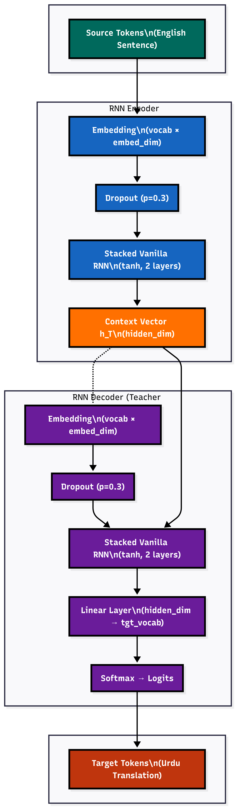
</p>

**How it works:**

1. **Encoder** reads the English sentence token-by-token, updating a hidden state at each step using `tanh`. The final hidden state `h_T` becomes the **Context Vector** — a single fixed-size vector compressing the entire source sentence.
2. **Context Vector** `h_T` is passed as the initial hidden state of the decoder.
3. **Decoder** generates the Urdu translation one token at a time. **Teacher forcing** is used during training.

**Encoder recurrence:**  `h_t = tanh(W_ih · x_t + W_hh · h_(t-1) + b)`

**Parameter Breakdown (best config: emb=256, hid=512, L=1, drop=0.2):**

| Component | Parameters | Size (MB) |
|---|---|---|
| Encoder Embedding (3821 × 256) | 977,664 | 3.91 |
| Encoder RNN (1 layer) | 920,064 | 3.68 |
| Decoder Embedding (4094 × 256) | 1,048,064 | 4.19 |
| Decoder RNN (1 layer) | 920,064 | 3.68 |
| Output Projection (512 → 4094) | 2,096,382 | 8.39 |
| **Total** | **4,914,942** | **19.66** |

> **Weight initialisation:** Input-hidden → Xavier uniform. Recurrent weights → Orthogonal. Biases → Zero. Padding embeddings → Fixed at zero.

---

## 🚀 Setup & Execution

### 1. Create and activate a virtual environment

```bash
python -m venv .venv
.venv\Scripts\activate        # Windows
# source .venv/bin/activate   # Linux / macOS
```

### 2. Install dependencies

```bash
pip install -r requirements.txt
```

### 3. Place the dataset

Put `english_to_urdu_dataset.xlsx` (columns: `eng`, `urdu`) at `data/english_to_urdu_dataset.xlsx`.

### 4. Run the notebooks

- **EDA:** `notebooks/dataset_statistics.ipynb`
- **Full pipeline:** `notebooks/english_to_urdu_nmt.ipynb` — run all cells sequentially. Auto-detects GPU and creates `outputs/`.

> Tested on NVIDIA Tesla T4 (15.64 GB) and RTX 4060 Laptop (8 GB).

---

## 📖 Pipeline Walkthrough & Results

---

### 1️⃣ Section 1 — Environment Setup

All random seeds locked (`SEED=42`) for deterministic reproducibility.

```
  Python        : 3.12.12        PyTorch  : 2.10.0+cu128
  Device        : cuda           GPU      : Tesla T4
  VRAM (GB)     : 15.64          CUDA     : 12.8
  ✅  Environment ready.
```

---

### 2️⃣ Section 2 — Data Loading & Exploration

```
  Shape : (9103, 2)   |   Total pairs : 9,103   |   Memory : 3.76 MB
  Missing values  →  urdu: 1,  eng: 0
  Full duplicate rows : 9  (0.10%)
```

**Raw corpus statistics:**

| | English | Urdu |
|---|---|---|
| Total tokens | 187,636 | 210,640 |
| Unique tokens | 7,156 | 8,111 |
| Mean length | 20.61 | 23.14 |
| Std | 9.70 | 10.63 |
| Max length | 68 | 84 |
| Length ratio (Urdu/Eng) | **1.161 ± 0.268** | |

<p align="center">
  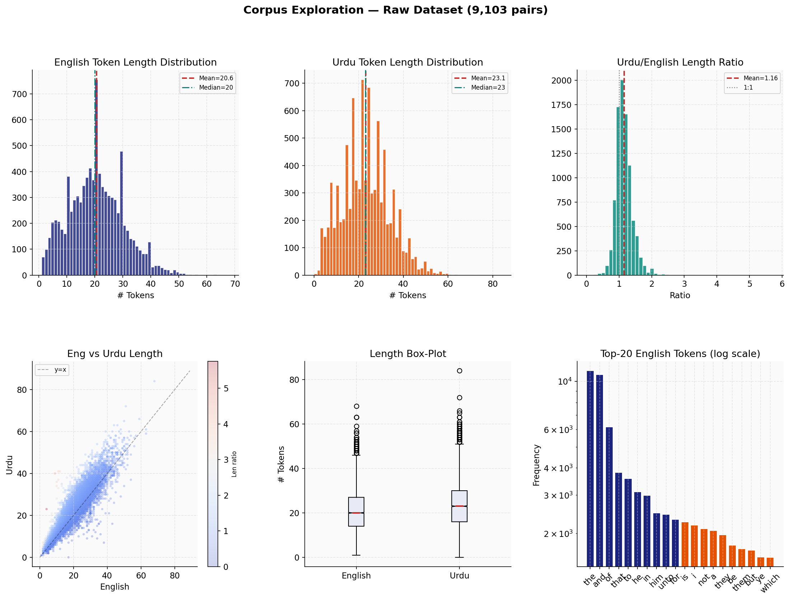
</p>

> Length histograms, Urdu/English length-ratio distribution, Eng vs Urdu scatter coloured by ratio, and top-20 token frequency bar charts.

---

### 3️⃣ Section 3 — Data Preprocessing

**English pipeline:** Lowercasing → URL removal → Unicode normalisation → punctuation collapsing → whitespace normalisation.

**Urdu pipeline:** Urdu punctuation mapping (`۔→.` `،→,` `؟→?`) → zero-width character removal → bracketed annotation stripping.

**Sequential quality filters:**

| Filter Stage | Rows Removed | Reason |
|---|---|---|
| Null removal | −19 | Missing values after cleaning |
| Exact deduplication | −9 | Full duplicate rows |
| Urdu script ratio < 40% | −1 | Non-Urdu content |
| Length cap at 97th pct (40/44 tokens) | −361 | Outlier-length sequences |
| Length-ratio filter [0.67, 2.20] | −171 | Extreme length asymmetry |
| **Final dataset** | **8,542 pairs** | **93.8% retained** |

<p align="center">
  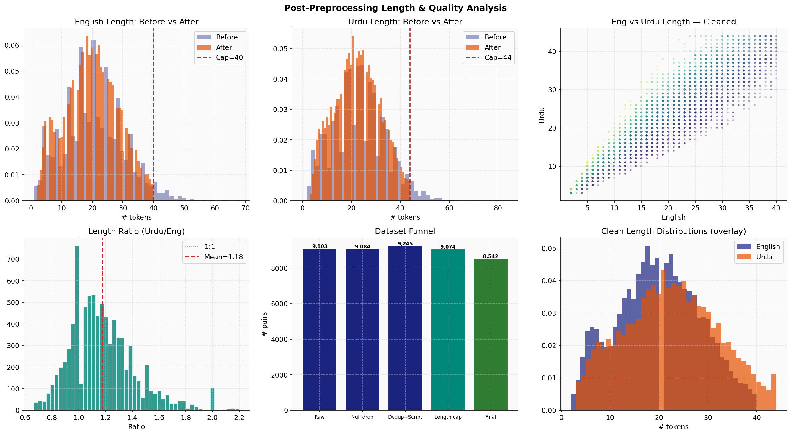
</p>

> Before/after length distributions, Urdu script-ratio histogram with threshold line, and dataset-size funnel across all filter stages.

---

### 4️⃣ Section 4 — Train/Val/Test Split

Stratified split on 5 quantile bins of source sentence length. Fixed `random_state=42`. Zero overlap verified programmatically.

| Split | Pairs | % | Eng μ±σ | Urdu μ±σ |
|---|---|---|---|---|
| Train | 6,823 | 79.9% | 19.9 ± 8.6 | 22.5 ± 9.3 |
| Validation | 864 | 10.1% | 19.7 ± 8.7 | 22.4 ± 9.5 |
| Test | 855 | 10.0% | 19.7 ± 8.6 | 22.4 ± 9.2 |

```
  Overlap Train ∩ Val  : 0  ✅     Overlap Train ∩ Test : 0  ✅     Overlap Val ∩ Test : 0  ✅
```

<p align="center">
  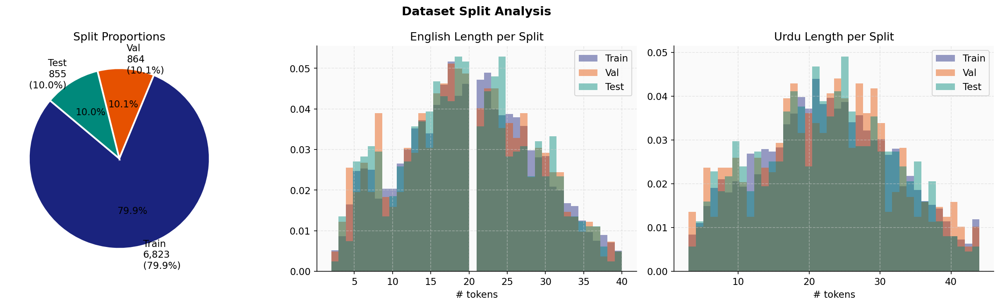
</p>

> Split proportions pie chart and per-split English/Urdu length density curves — all three splits show near-identical distributions.

---

### 5️⃣ Section 5 — Tokenisation & Vocabulary

Word-level tokenisation. Vocabularies built from **training set only** with `min_freq = 2`.

| Token | Index | | Metric | ENG | URDU |
|---|---|---|---|---|---|
| `<pad>` | 0 | | Vocab size | **3,821** | **4,094** |
| `<bos>` | 1 | | Singletons excluded | 2,372 | 2,869 |
| `<eos>` | 2 | | Val OOV rate | 3.42% | 3.44% |
| `<unk>` | 3 | | Test OOV rate | 3.35% | 3.21% |

<p align="center">
  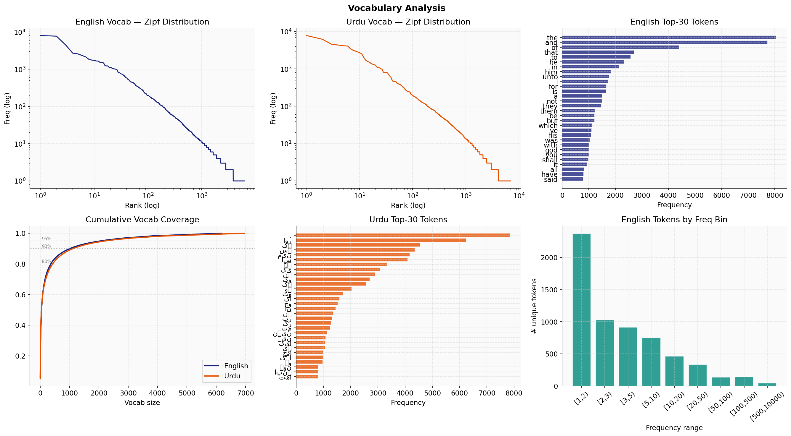
</p>

> Zipf distributions (log-log scale), top-30 token bar charts for both languages, and cumulative coverage curves with 80/90/95% markers.

---

### 6️⃣ Section 6 — Batching & Padding

Dynamic padding to batch maximum length. Decoder input (`tgt_in`) is teacher-forced ground-truth; label (`tgt_out`) is shifted left.

```
  Train batches : 107   Val batches : 14   Test batches : 14   Batch size : 64

  src     shape : torch.Size([64, 39])    src    padding : 48.9%
  tgt_in  shape : torch.Size([64, 45])    tgt_in padding : 49.1%
```

<p align="center">
  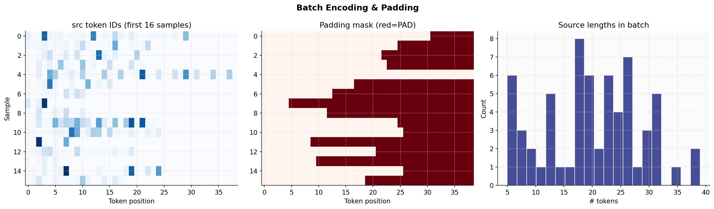
</p>

> Source token-ID heatmap, padding mask (red = `<pad>`), and sequence length histogram within a sample batch.

---

### 7️⃣ Section 7 — Model Architecture

```
Seq2Seq(
  (encoder): RNNEncoder(
    (embedding): Embedding(3821, 256, padding_idx=0)
    (dropout):   Dropout(p=0.2)
    (rnn):       RNN(256, 512, num_layers=1, batch_first=True)
  )
  (decoder): RNNDecoder(
    (embedding): Embedding(4094, 256, padding_idx=0)
    (dropout):   Dropout(p=0.2)
    (rnn):       RNN(256, 512, num_layers=1, batch_first=True)
    (fc_out):    Linear(in_features=512, out_features=4094, bias=True)
  )
)
  Total parameters : 4,914,942   |   Model size : 19.66 MB (float32)   |   Device : cuda:0
  ✅  Forward pass OK.  Output logits shape : (4, 10, 4094)
```

<p align="center">
  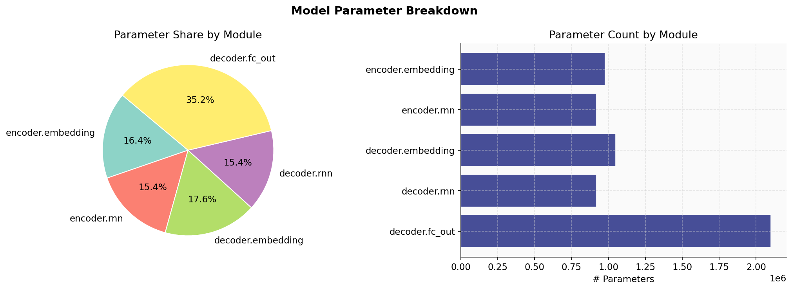
</p>

> Parameter breakdown — pie chart (% share per component) and bar chart (absolute counts). Output projection dominates at 42.7% owing to the large target vocabulary.

---

### 8️⃣ Section 8 — Training Dynamics

| Setting | Value |
|---|---|
| Loss | Label-smoothed cross-entropy (ε = 0.1) |
| Optimizer | Adam (β₁=0.9, β₂=0.98, ε=1e-8) |
| Gradient clipping | L2 norm ≤ 1.0 |
| LR scheduler | ReduceLROnPlateau (factor=0.5, patience=3) |
| Early stopping | Patience = 7 epochs |

**Full training log (best config, retrained from scratch):**

```
  Epoch │ Train Loss │  Val Loss │  Val PPL │       LR │  Time
  ─────────────────────────────────────────────────────────────
      1 │     5.1460 │    4.7228 │   112.48 │ 1.00e-03 │  2.8s  ← BEST ✓
      2 │     4.4642 │    4.2117 │    67.47 │ 1.00e-03 │  2.6s  ← BEST ✓
      3 │     4.1100 │    4.0237 │    55.90 │ 1.00e-03 │  2.6s  ← BEST ✓
      4 │     3.8972 │    3.9067 │    49.73 │ 1.00e-03 │  2.6s  ← BEST ✓
      5 │     3.7202 │    3.8362 │    46.35 │ 1.00e-03 │  2.6s  ← BEST ✓
      6 │     3.5698 │    3.7910 │    44.30 │ 1.00e-03 │  2.7s  ← BEST ✓
      7 │     3.4349 │    3.7641 │    43.12 │ 1.00e-03 │  2.6s  ← BEST ✓
      8 │     3.3140 │    3.7371 │    41.98 │ 1.00e-03 │  2.6s  ← BEST ✓
      9 │     3.1974 │    3.7295 │    41.66 │ 1.00e-03 │  2.6s  ← BEST ✓
  ★  10 │     3.0917 │    3.7217 │    41.34 │ 1.00e-03 │  2.7s  ← BEST ✓
     11 │     2.9902 │    3.7284 │    41.61 │ 1.00e-03 │  2.6s
     12 │     2.8940 │    3.7319 │    41.76 │ 1.00e-03 │  2.6s
     13 │     2.8034 │    3.7417 │    42.17 │ 1.00e-03 │  2.6s
     14 │     2.7160 │    3.7436 │    42.25 │ 1.00e-03 │  2.6s
     15 │     2.5652 │    3.7408 │    42.13 │ 5.00e-04 │  2.8s
     16 │     2.5134 │    3.7495 │    42.50 │ 5.00e-04 │  2.6s
     17 │     2.4694 │    3.7549 │    42.73 │ 5.00e-04 │  2.6s
  ⏹  Early stopping at epoch 17.

  ✅  Best epoch : 10   |   Best val loss : 3.7217   |   Best val PPL : 41.34
  ⚠️  Generalisation gap at best epoch : 0.63
```

<p align="center">
  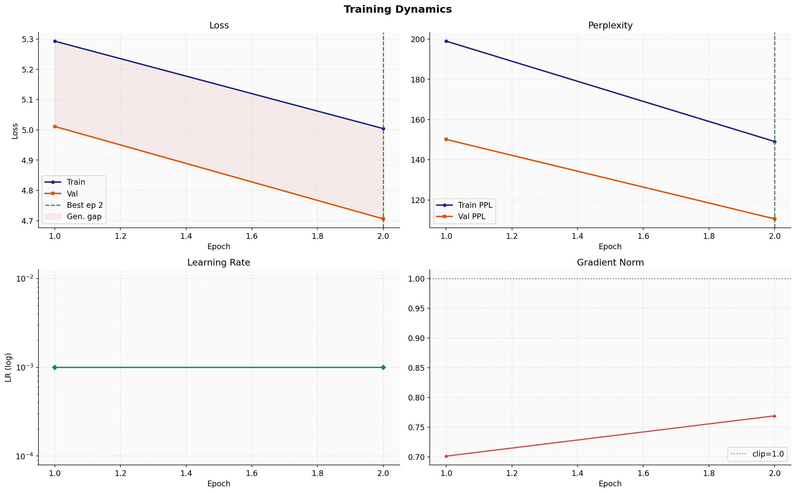
</p>

> Train/val loss with generalisation gap shading, perplexity curves, LR schedule, and gradient L2 norm per epoch.

---

### 9️⃣ Section 9 — Hyperparameter Grid Search

**8 configurations × 8 epochs each.**

| Rank | Emb | Hid | L | LR | Drop | BS | Val Loss | Val PPL | Params |
|---|---|---|---|---|---|---|---|---|---|
| 🥇 **1** | 256 | 512 | **1** | 1e-3 | 0.2 | 64 | **3.735** | **41.89** | 4,914,942 |
| 2 | 256 | 256 | 1 | 1e-3 | 0.2 | 64 | 3.741 | 42.13 | 3,341,566 |
| 3 | 256 | 512 | 2 | 1e-3 | 0.2 | 64 | 3.809 | 45.09 | 5,965,566 |
| 4 | 128 | 256 | 1 | 1e-3 | 0.2 | 64 | 3.829 | 46.00 | 2,262,910 |
| 5 | 128 | 512 | 1 | 1e-3 | 0.2 | 64 | 3.834 | 46.23 | 3,770,750 |
| 6 | 256 | 512 | 2 | 1e-3 | 0.3 | 32 | 3.836 | 46.35 | 5,965,566 |
| 7 | 256 | 512 | 2 | 1e-3 | 0.3 | 64 | 3.894 | 49.10 | 5,965,566 |
| 8 | 256 | 512 | 2 | 5e-4 | 0.2 | 64 | 3.913 | 50.06 | 5,965,566 |

> **Key insight:** 1-layer RNN (rank 1) outperforms 2-layer (rank 3) — depth alone does not compensate for vanishing gradients in vanilla RNNs.

<p align="center">
  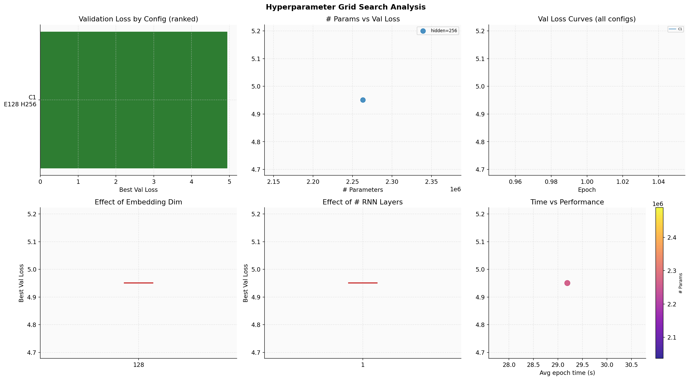
</p>

> Ranked validation loss bar, parameter count vs loss scatter, validation curves for all 8 configs, and per-hyperparameter effect plots.

---

### 🔟 Section 10 — Inference & BLEU Evaluation

Best checkpoint (epoch 10) evaluated on all **855 test sentences**.

**BLEU Scores:**

| Decoding Method | BLEU-1 | BLEU-2 | BLEU-3 | BLEU-4 | Speed |
|---|---|---|---|---|---|
| **Greedy** | **21.026** | **7.420** | **2.573** | 0.903 | 19.7 ms/sent |
| **Beam (k=4)** | 12.470 | 4.232 | 1.830 | **0.957** | 136.5 ms/sent |

Sentence-level BLEU: Greedy `2.31 ± 1.39` &nbsp;|&nbsp; Beam-4 `1.79 ± 2.04`

**OOD Robustness** (> 31 tokens or ≥ 2 OOV tokens):

| Condition | n | BLEU-1 | BLEU-4 | Rel. Drop |
|---|---|---|---|---|
| In-Distribution | 655 | 13.373 | 1.015 | — |
| OOD | 200 | 9.732 | 0.739 | **−27.2%** |

<p align="center">
  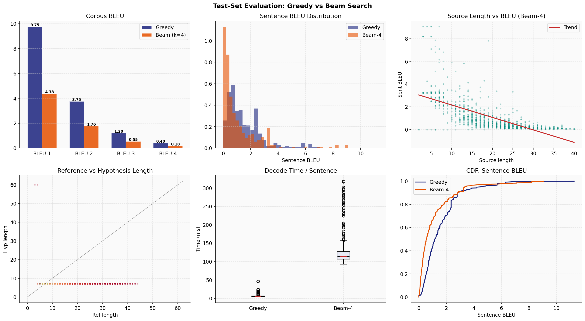
</p>

> Corpus BLEU grouped bar, sentence BLEU density, source length vs BLEU scatter, reference vs hypothesis length, latency box-plots, and sentence BLEU CDF.

---

### 1️⃣1️⃣ Section 11 — Error Analysis & Discussion

All 855 beam-4 outputs classified into 8 error categories.

**Error Type Distribution:**

| Error Type | Count | % | Definition |
|---|---|---|---|
| **Complete Hallucination** | **562** | **65.7%** | Zero lexical overlap with reference |
| Partial Match | 251 | 29.4% | Some content correct but incomplete |
| Severe Over-generation | 23 | 2.7% | Hypothesis > 200% reference length |
| Near Miss | 7 | 0.8% | High overlap, minor lexical errors |
| Poor Reordering | 7 | 0.8% | Correct vocab, wrong word order |
| Acceptable (BLEU ≥ 20) | 2 | 0.2% | Reasonably correct |
| Repetition Loop | 2 | 0.2% | Decoder looping same token |
| Severe Under-generation | 1 | 0.1% | Hypothesis < 30% reference length |

**🚨 Dominant Failure: Fixed-Phrase Mode Collapse**

**65.7%** of all outputs collapse to one single phrase:

> اس نے ان سے کہا اے خداوند میں تجھ سے کہتا ہوں . &nbsp;*(He said to them, O Lord, I say to thee.)*

This is the maximum-likelihood degenerate solution when the context vector loses source discriminability — a canonical pathology of non-attentive encoder–decoder models.

**Limitations of Vanilla RNNs:**

| Limitation | Root Cause | Empirical Evidence |
|---|---|---|
| Vanishing gradients | `tanh` shrinks ∂h/∂h exponentially over time | Val loss plateaus at epoch 10 |
| Information bottleneck | Entire sentence compressed into 512-D `h_T` | 65.7% mode collapse rate |
| Poor word-order reordering | No attention to dynamically re-access source | "Poor Reordering" error class |
| Repetition / degeneration | No coverage mechanism | Repetition Loop errors |
| OOV sensitivity | Word-level vocab maps rare tokens to `<unk>` | −27.2% OOD BLEU-4 drop |

**Future Improvement Roadmap:**

| Priority | Improvement |
|---|---|
| 🔴 Short-term | LSTM / GRU cells + bidirectional encoder |
| 🔴 Short-term | Bahdanau attention mechanism |
| 🔴 Short-term | BPE / SentencePiece subword tokenisation |
| 🟡 Medium-term | Full Transformer (Vaswani et al. 2017) |
| 🟡 Medium-term | Fine-tune mBART-50 for Urdu |
| 🟢 Data-side | Back-translation, curriculum learning |
| 🟢 Data-side | Broaden corpus beyond biblical domain |

<p align="center">
  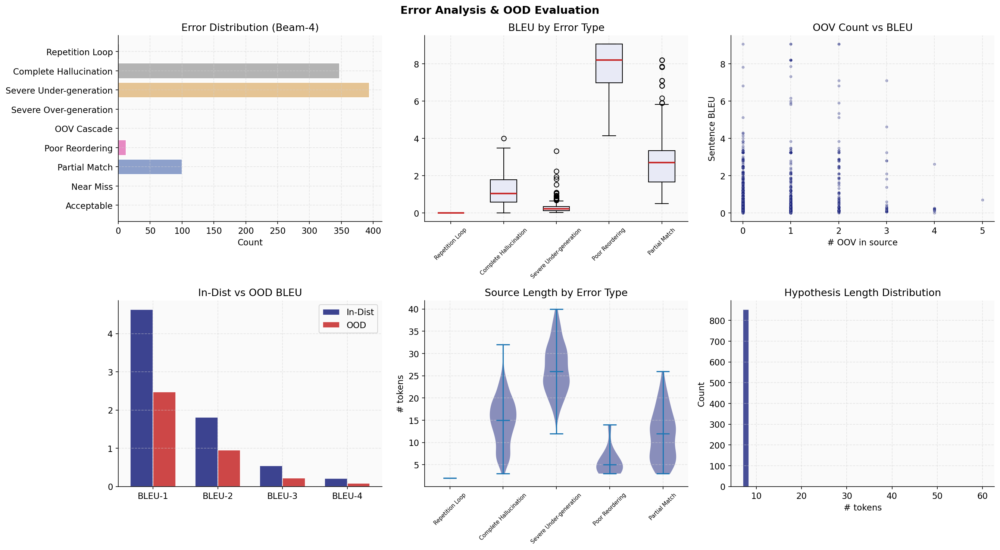
</p>

> Error type bar chart, sentence BLEU box-plots per error category, OOV count vs BLEU, ID vs OOD BLEU comparison, and source-length violin plots by error type.

---

## 📊 Final Experiment Summary

```
╔══════════════════════════════ FINAL EXPERIMENT SUMMARY ═══════════════════════╗

  ── DATASET ───────────────────────────────────────────────────────────────────
  Raw sentence pairs                    : 9,103
  After all cleaning & filtering        : 8,542  (93.8% retention)
  Train / Val / Test                    : 6,823 / 864 / 855

  ── VOCABULARY ────────────────────────────────────────────────────────────────
  English vocab size                    : 3,821
  Urdu vocab size                       : 4,094
  Min token frequency                   : 2
  Val OOV rate (ENG / URDU)             : 3.42% / 3.44%

  ── MODEL ─────────────────────────────────────────────────────────────────────
  Architecture                          : Vanilla RNN Encoder-Decoder (tanh)
  Embedding dim / Hidden dim / Layers   : 256 / 512 / 1
  Dropout / Label smoothing             : 0.2 / 0.1
  Total parameters                      : 4,914,942
  Model size (MB)                       : 19.66

  ── TRAINING ──────────────────────────────────────────────────────────────────
  Epochs trained / Best epoch           : 17 / 10
  Best val loss / PPL                   : 3.7217 / 41.34
  Final train loss                      : 2.4694
  Generalization gap                    : 0.6300

  ── TEST SET EVALUATION ───────────────────────────────────────────────────────
  Greedy  BLEU-1 / BLEU-4               : 21.026 / 0.903
  Beam-4  BLEU-1 / BLEU-4               : 12.470 / 0.957
  Beam-4 avg decode time (ms/sent)      : 136.5

  ── OOD EVALUATION ────────────────────────────────────────────────────────────
  ID  BLEU-4 (beam-4)                   : 1.015
  OOD BLEU-4 (beam-4)                   : 0.739
  Relative degradation                  : −27.2%

  ── ERROR ANALYSIS ────────────────────────────────────────────────────────────
  Most common error                     : Complete Hallucination (65.7%)
  Acceptable translations               : 0.2%  (2 / 855)

╚══════════════════════════════════════════════════════════════════════════════╝
```

<p align="center">
  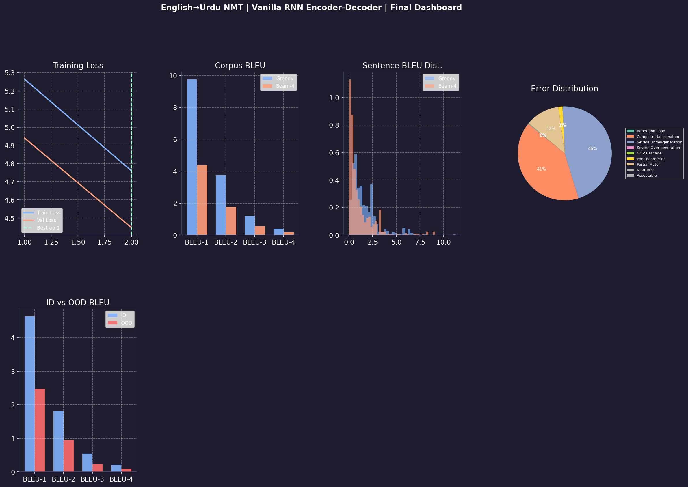
</p>

> 4-panel summary dashboard: train/val loss curves, corpus BLEU-1 to BLEU-4, sentence BLEU density, and error-type pie chart.

---

## 📁 Generated Artifacts

**`outputs/plots/`**

| File | Description |
|---|---|
| `01_corpus_exploration.png` | Length histograms, scatter, top-20 tokens |
| `02_preprocessing_analysis.png` | Filter funnel, script-ratio, before/after |
| `03_dataset_split.png` | Split proportions, per-split length densities |
| `04_vocabulary_analysis.png` | Zipf distributions, top-30 bar charts |
| `05_batch_structure.png` | Token-ID heatmap, padding mask |
| `06_model_architecture.png` | Parameter breakdown pie & bar |
| `07_training_dynamics.png` | Loss/PPL curves, LR schedule, grad norms |
| `08_hyperparameter_search.png` | Grid search leaderboard, config curves |
| `09_bleu_evaluation.png` | BLEU bars, length scatter, CDF, latency |
| `10_error_analysis.png` | Error bars, BLEU boxplots, OOD comparison |
| `11_final_dashboard.png` | Consolidated 4-panel summary |

**`outputs/results/`**

| File | Description |
|---|---|
| `cleaned_dataset.csv` | 8,542 preprocessed pairs |
| `train/val/test_split.csv` | Split CSVs |
| `src_vocab.pkl` / `tgt_vocab.pkl` | Pickled vocabulary objects |
| `training_history.csv` | Per-epoch train loss, val loss, PPL, LR |
| `grid_search_results.csv` | Full grid search leaderboard |
| `bleu_scores.csv` | Corpus BLEU-1 through BLEU-4 |
| `translation_examples.csv` | Per-sentence BLEU + decoded outputs |
| `error_analysis.csv` | Error category per test sentence |
| `final_summary.csv` | All key metrics consolidated |

**`outputs/checkpoints/`**

| File | Description |
|---|---|
| `best_model.pt` | Checkpoint saved at epoch 10 (val loss = 3.7217) |

---

## 📄 Citation

```bibtex
@misc{idrees2024engurdu,
  title   = {English--Urdu Neural Machine Translation Using a Vanilla RNN Encoder--Decoder},
  author  = {Muhammad Idrees},
  year    = {2024},
  school  = {FAST-NUCES Islamabad},
  note    = {Generative AI Assignment \#1}
}
```

---

<p align="center">
  Built at <strong>FAST-NUCES Islamabad</strong> · Department of Computer Science
</p>
